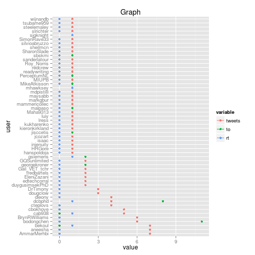

Demo of using twitter-hashtag-analytics package to analyze tweets
========================================================

1. Data preparation
-----------------------

First thing first:


```r
# set working directory
setwd("~/src/r/twitter-analytics/twitter-hashtag-analytics")

# load source files
source("get_tweets.R")
```

```
## Loading required package: RCurl
```

```
## Loading required package: bitops
```

```
## Loading required package: rjson
```

```r
source("munge_tweets.R")
source("utilities.R")
```


Retrieve a Twitter hashtag dataset by search:


```r
# get tweets by search
df <- GetTweetsBySearch('#LAK13')

# check names of columns
names(df)
```

```
##  [1] "text"         "favorited"    "replyToSN"    "created"     
##  [5] "truncated"    "replyToSID"   "id"           "replyToUID"  
##  [9] "statusSource" "screenName"
```

```r

# how many unique Twitter accounts in the dataset
length(unique(df$screenName))
```

```
## [1] 54
```


Some pre-processing tasks:


```r
# removing odd characters
df <- RemoveOddChars(df)
# extract user info and add to df
df <- ExtractUserInfo(df)
```


2. Count stuff
----------------------


```r
library(ggplot2)
library(reshape2)

# Count tables
countsSortSubset <- GetTweetCountTable(df, "screenName")
countRTSortSubset <- GetTweetCountTable(df, "rt")
countToSortSubset <- GetTweetCountTable(df, "to")

# combine counts into one data frame
counts1 <- merge(countsSortSubset, countRTSortSubset, by = "user", all.x = TRUE)
counts <- merge(counts1, countToSortSubset, by = "user", all.x = TRUE)
colnames(counts) <- c("user", "tweets", "to", "rt")
counts[is.na(counts)] <- 0
counts$tweets <- as.numeric(counts$tweets)
counts$to <- as.numeric(counts$to)
counts$rt <- as.numeric(counts$rt)

# melt data
counts.melt <- melt(counts, id.vars = c("user"))

# plot (Cleveland dot plot)
ggplot(counts.melt, aes(x = user, y = value, color = variable)) + geom_point() + 
    geom_line() + coord_flip() + ggtitle("Graph")
```

```
## geom_path: Each group consist of only one observation. Do you need to
## adjust the group aesthetic?
```

 

